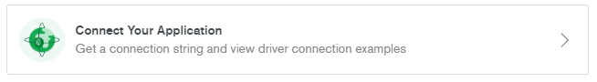

<br>
<br>
<br>


# TESTful API *(Working-In-Progress)*

RESTful API for testing Internet of Things (IoT) devices and prototypes. It is also an API platform that allows you to build IoT prototypes. It is built with Node.js, Express.js and MongoDB.

## Table of contents

- [Getting Started](#getting-started)
    - [Installation](#installation)
- [API Documentations](#api-documentations)
- [Create Your Own MongoDB](#create-your-own-mongodb)
    - [Build a New Cluster](#build-a-new-cluster)
    - [Getting SRV Connection String](#getting-srv-connection-string)
- [Deployment](#deployment)
- [To-Dos](#to-dos)
- [Built With](#built-with)
- [Version](#version)
- [Authors](#authors)
- [License](#license)
- [Acknowledgments](#acknowledgments)


## Getting Started
[(Back to top)](#table-of-contents)

Node.js must be installed on local machine in order to run the app. If your local machine does not have Node.js installed, you can download and install from the officical [website](https://nodejs.org/en/download/).


### Installation

If you want to run the latest code from git, here's how to get started:

1. Clone the code:

        git clone https://github.com/theinhtut/TESTful-API.git
        cd TESTful-API

2. Install testful-api dependencies

        npm install

3. Run

        npm start
   or

        node server.js

Once the server has started, you will see the following in your console.
```sh        
testful-api@1.0.0 start <YOUR_PATH>\testful-api
node server.js

Server has started on port: 3000
MongoDb is connected...
```

## API Documentations
[(Back to top)](#table-of-contents)

API documentations of all the endpoints are powered by [Swagger](https://swagger.io/). You can go to `http://localhost:3000/docs` to view the full documentations.  


## Create Your Own MongoDB
[(Back to top)](#table-of-contents)

If you need to have your own MongoDB' cluster, you must [sign up](https://www.mongodb.com/) your MongoDB account first.

### Build a New Cluster
"Build a new cluster" in MongoDB.  


### Getting SRV Connection String  
1.  Click on "Connect" --> "Connect Your Application"  


2.  Copy your Short SRV connection String  


3. Open the key.js file under the folder `config/keys.js`  
Then, replace your SRV key in `MongoURI: 'YOUR MONGODB SRV CONNECTION STRING'`


## Deployment
[(Back to top)](#table-of-contents)

Currently working in progres to deploy this on a live system.

## To-Dos
[(Back to top)](#table-of-contents)

Currently Working in Progress
- [x] API Documentations
- [ ] Live Server Deployment
- [ ] Dashboard
- [ ] Better UI/UX
- [ ] Integrate NodeRED


## Built With
[(Back to top)](#table-of-contents)

* [Node.js](http://nodejs.org/) - Node.js® is a JavaScript runtime built on Chrome's V8 JavaScript engine.
* [Express.js](https://expressjs.com/) - A web application framework for Node.js
* [MongoDB](https://www.mongodb.com/) - A cross-platform document-oriented database program, JSON-like documents with schemata
* [Swagger](https://swagger.io/) - API Documentation editor


## Version
[(Back to top)](#table-of-contents)

TESTful-API v1.0.0

## Authors
[(Back to top)](#table-of-contents)

* **Thein Htut** - *TESTful-API* - [Github](https://github.com/theinhtut)

See also the list of [contributors](https://github.com/theinhtut/TESTful-API/graphs/contributors) who participated in this project.

## License
[(Back to top)](#table-of-contents)

This project is licensed under the MIT License - see the [LICENSE](LICENSE) file for details

## Acknowledgments
[(Back to top)](#table-of-contents)

* Brillianda Sheravina - For inspiration by love ❤
* [Academind](https://www.youtube.com/channel/UCSJbGtTlrDami-tDGPUV9-w) - Awesome YouTube tutorials on RESTful API
* To anyone whose codes were used as reference.
